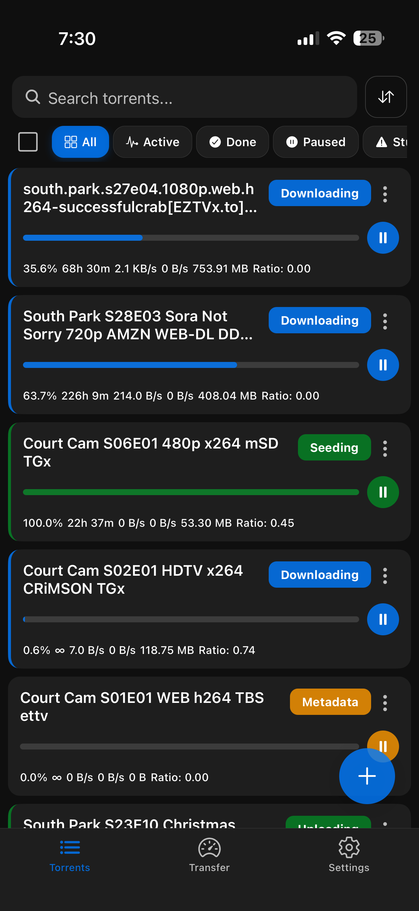
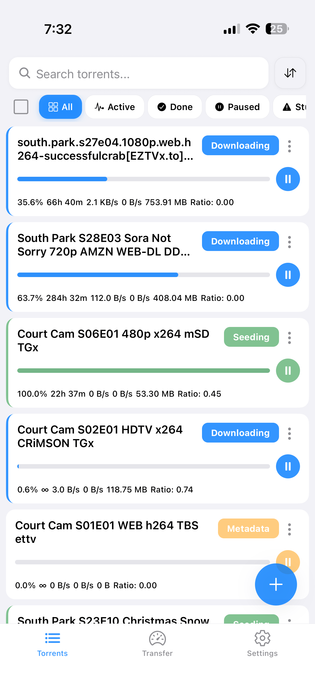
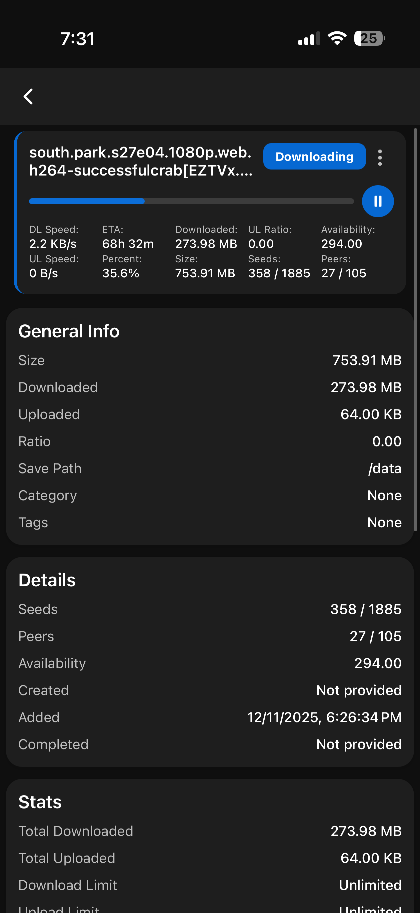
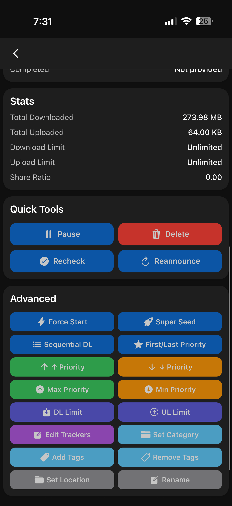
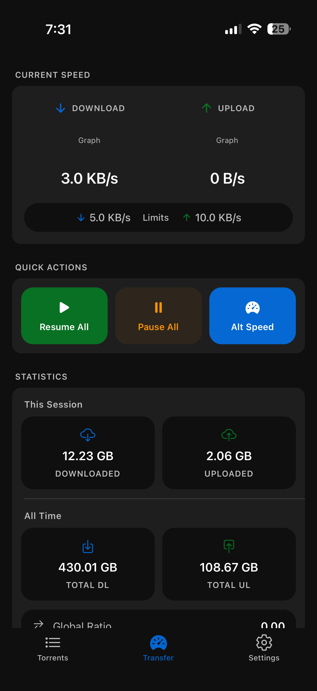
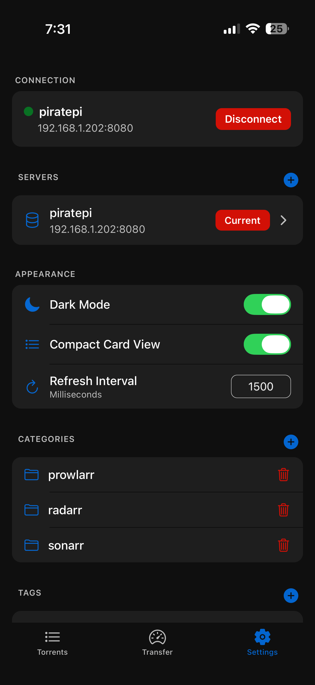
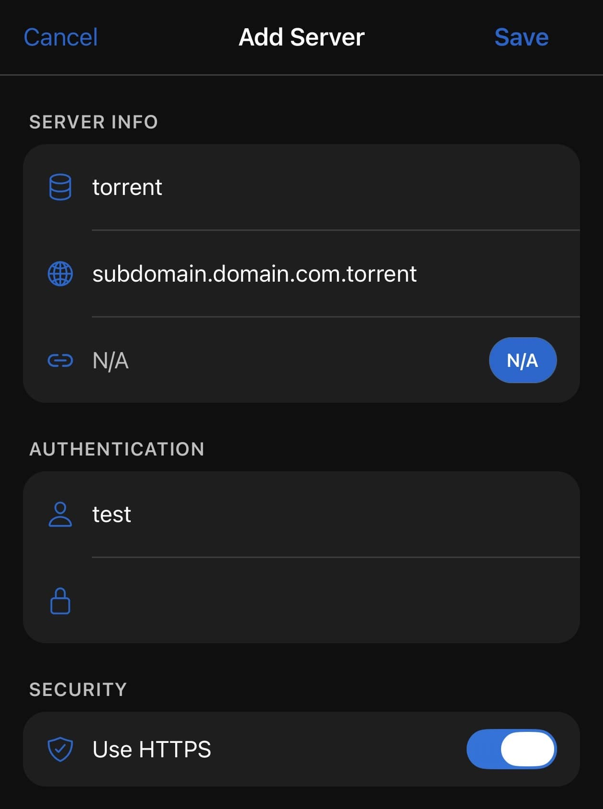

# qRemote

Native iOS app for qBittorrent. Finally, a proper mobile interface instead of pinch-zooming the web UI.

**[Join TestFlight Beta](https://testflight.apple.com/join/ZHp9Uq4h)** • **[GitHub](https://github.com/taylorcox75/qRemote/)**

## Screenshots

### Torrents List
Dark mode and light mode both work. Filter by status, search, and sort however you want.

<p align="center">
  
  
</p>

### Torrent Details
Everything you need in one place. Speeds, trackers, files, peers. Pause, delete, recheck, change priorities.

<p align="center">
  
  
</p>

### Transfer Monitor
Watch your speeds and tweak limits on the fly. Quick presets or set your own values.

<p align="center">
  
</p>

### Settings
Connect to multiple servers. Supports IP addresses, hostnames, and subdomains. Manage categories and tags.

<p align="center">
  
</p>

<p align="center">
  
</p>

## What It Does

- Manage torrents: pause, resume, delete, recheck, reannounce
- Monitor transfers with real-time updates
- Set speed limits (global and per-torrent)
- Manage trackers, files, and priorities
- Multiple servers with secure credential storage
- Categories and tags
- Dark/light mode

## Requirements

- qBittorrent 4.1+ with WebUI enabled
- iOS 14+
- Node.js 18+ (for development)

## Getting Started

```bash
git clone https://github.com/yourusername/qRemote.git
cd qRemote
npm install
npm start
```

Scan the QR code with Expo Go or press `i` for iOS simulator.

### Building

```bash
npm install -g eas-cli
eas login
eas build --platform ios --profile production
```

## Setup

1. Go to Settings → tap **+** 
2. Add your qBittorrent server (IP/hostname, port, credentials)
3. Enable HTTPS if needed
4. Connect and you're good to go

## Built With

React Native (Expo), TypeScript, Expo Router

## Contributing

PRs welcome. Issues too.

## License

MIT

