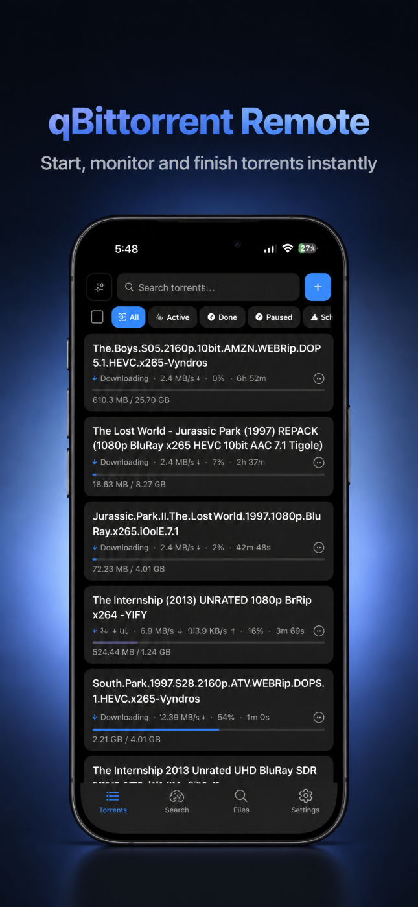
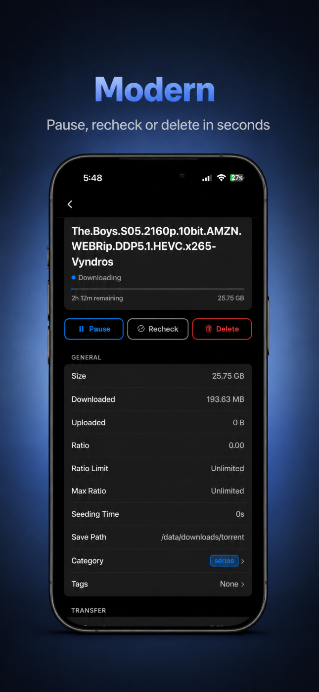
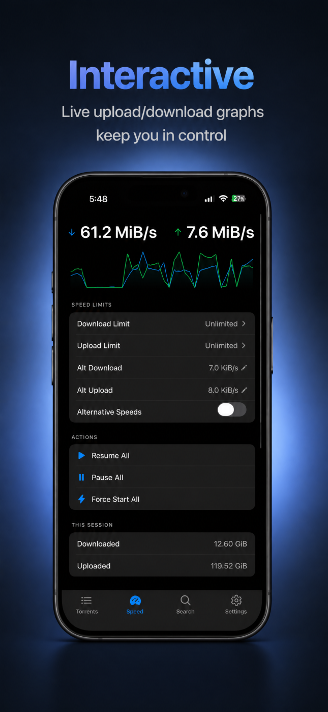
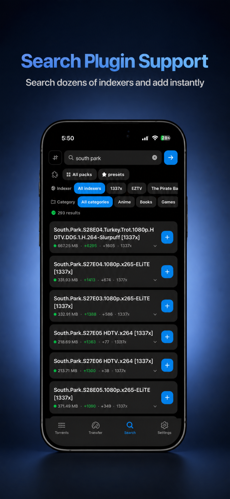
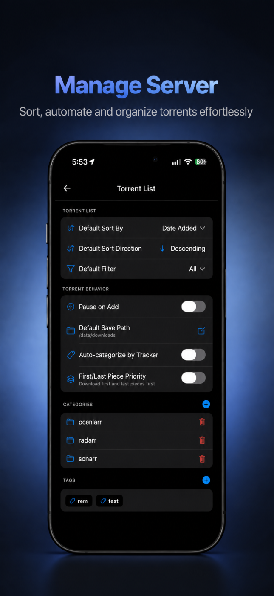

# qRemote

[](https://github.com/taylorcox75/qRemote/actions/workflows/ios-deploy.yml)

<p align="center">
  <a href="https://github.com/taylorcox75/qRemote/actions/workflows/ios-deploy.yml">
    
  </a>
  &nbsp;➜&nbsp;
  <a href="https://github.com/taylorcox75/qRemote/actions/workflows/ios-deploy.yml">
    
  </a>
  &nbsp;➜&nbsp;
  <a href="https://github.com/taylorcox75/qRemote/actions/workflows/ios-deploy.yml">
    
  </a>
  &nbsp;➜&nbsp;
  <a href="https://github.com/taylorcox75/qRemote/actions/workflows/ios-deploy.yml">
    
  </a>
</p>

<p align="center"><sub>Runs automatically on every version bump to <code>main</code> &nbsp;•&nbsp; click any stage to view the pipeline run</sub></p>

**The fast, modern iOS remote for qBittorrent.**

qRemote puts your entire qBittorrent server in your pocket. Start, monitor, and finish torrents from anywhere — with live updates every couple of seconds, a polished dark UI, one-tap actions, and built-in search across dozens of indexers. No web UI pinching and zooming, no clunky wrappers: a real native-feeling app designed for your thumb.

**iOS:** [Download on the App Store](https://apps.apple.com/app/qremote-for-qbittorrent/id6756276747) · [TestFlight Beta](https://testflight.apple.com/join/ZHp9Uq4h) · [GitHub](https://github.com/taylorcox75/qRemote/)

<p align="center">
  
</p>

Your torrents at a glance: every card shows status, speed, progress, and ETA in real time, with one-tap pause/resume and swipe actions. Filter by state — All, Active, Done, Paused, Scheduled — search the list instantly, and sort however you want. Adding is just as fast: paste a magnet link, open a `.torrent` file straight from the Files app, or tap **+** and go.

## Manage Torrents

<p align="center">
  
</p>

Tap into any torrent for total control. The big three — **Pause**, **Recheck**, **Delete** — sit right at the top, one tap away. Below, everything qBittorrent knows about the torrent, live and editable:

- **General stats** — size, downloaded, uploaded, ratio, and seeding time at a glance
- **Ratio & seeding limits** — set per-torrent ratio limits and seeding time without touching the desktop
- **Save path, category & tags** — reorganize your library from your couch; categories and tags are fully editable in-app
- **Trackers, files & peers** — inspect trackers, reannounce, set per-file priorities, and watch who you're connected to
- **More actions** — force start, reannounce, and per-torrent speed limits when you need them

No digging through nested menus. Everything about a torrent lives on one screen.

## Manage Transfers

<p align="center">
  
</p>

A live, scrolling upload/download graph keeps you in control of your bandwidth — watch a 61 MiB/s download happen in real time. Then shape it:

- **Global speed limits** — set download and upload caps in seconds
- **Alternative speeds** — configure alt limits and flip them on with a single toggle when you need your connection back
- **Bulk actions** — Resume All, Pause All, or Force Start All in one tap
- **Session & all-time stats** — see exactly how much you've moved today and forever
- **Connection health** — DHT nodes, connected peers, and free disk space on your server, always visible

It's the qBittorrent status bar, reimagined for a phone — and it updates live while you watch.

## Search Plugin Support

<p align="center">
  
</p>

Stop hopping between browser tabs. qRemote drives qBittorrent's search plugins directly, so you can search **dozens of indexers at once** and add results in one tap:

- **All your plugins, one search bar** — query every installed plugin pack simultaneously, or narrow to a single one
- **Filter chips for indexer & category** — slice hundreds of results by indexer (1337x, EZTV, The Pirate Bay, …) or category (Anime, Books, Games, …) instantly
- **Works great with Prowlarr & Jackett** — indexer labels are detected and filterable
- **Seeders, leechers & size up front** — spot the healthy release before you commit
- **One-tap add** — hit **+** and the torrent is on your server, downloading before you've locked your phone
- **Plugin management built in** — install, enable, and remove search plugins from inside the app

Search, evaluate, add. Ten seconds, start to finish.

## Server Management

<p align="center">
  
</p>

Make qBittorrent behave *your* way, and manage every server you run:

- **Smart defaults** — pick the default sort, sort direction, and filter for your torrent list
- **Torrent behavior** — pause on add, default save path, first/last piece priority for instant previews
- **Auto-categorize by tracker** — new torrents file themselves into the right category automatically
- **Full category & tag management** — create and delete categories (radarr, sonarr, …) and tags right from the app
- **Multiple servers** — add as many qBittorrent instances as you run and switch between them
- **Security built in** — credentials in the iOS secure enclave (never plain text), HTTPS support, and reverse-proxy Basic Auth for setups behind nginx/Traefik

## Everything Else

- Real-time incremental sync — updates every 2–3 seconds without hammering your server
- Fully customizable theme — override any color, with dark and light modes
- 6 languages: English, Spanish, Chinese, French, German, Russian
- Registers as an "Open With" handler for `.torrent` files in the Files app
- Connectivity logs for troubleshooting your connection

## Requirements

- qBittorrent 4.1+ with WebUI enabled
- iOS 16.4+
- Node.js 18+ (for development)

## Getting Started

```bash
git clone https://github.com/taylorcox75/qRemote.git
cd qRemote
npm install
npm start
```

Scan the QR code with Expo Go or press `i` for iOS simulator.

### Building

```bash
npm install -g eas-cli
eas login
eas build --platform ios --profile production
```

## Setup

1. Go to Settings → tap **+**
2. Add your qBittorrent server (IP/hostname, port, credentials)
3. Enable HTTPS if needed
4. Connect and you're good to go

## Built With

React Native (Expo), TypeScript, Expo Router

## Contributing

PRs welcome. Issues too.

## License

MIT
